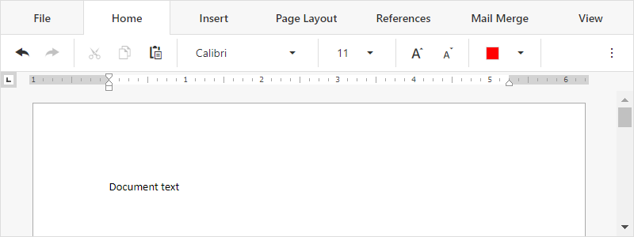

<!-- default badges list -->

[](https://supportcenter.devexpress.com/ticket/details/T848108)
[](https://docs.devexpress.com/GeneralInformation/403183)
[](#does-this-example-address-your-development-requirementsobjectives)
<!-- default badges end -->
# Rich Text Editor for ASP.NET Core - Add the control to an Angular application

This example is a ready-to-use Angular client application that contains the DevExpress [Rich Text Editor](https://docs.devexpress.com/AspNetCore/400373/office-inspired-controls/controls/rich-edit) control.



Refer to the following topic for more information: [Add RichEdit to an Angular Application](https://docs.devexpress.com/AspNetCore/401527/rich-edit/get-started/angular-application).

## Requirements

* To use the Rich Text Editor control in an Angular application, you need to have a [Universal, DXperience, or ASP.NET subscription](https://www.devexpress.com/buy/net/).
* Versions of the DevExpress npm packages should match.

## Quick Start

Follow the steps below to run this application on your computer:

1. Open the *JS* folder in the command prompt and run the following command to install npm packages used in the application:

    ```
    npm install
    ```

2. Execute the following command to compile and run the application:

    ```
    ng serve --open
    ```

## Files to Review

* [richedit.component.ts](JS/src/app/richedit/richedit.component.ts)
* [app.component.html](JS/src/app/app.component.html)
* [angular.json](/JS/angular.json)

## Documentation

- [Rich Text Editor](https://docs.devexpress.com/AspNetCore/400373/rich-edit)

## More Examples

- [RichEdit for Angular - How to customize the built-in ribbon](https://github.com/DevExpress-Examples/richedit-for-angular-how-to-customize-the-built-in-ribbon)
<!-- feedback -->
## Does this example address your development requirements/objectives?

[](https://www.devexpress.com/support/examples/survey.xml?utm_source=github&utm_campaign=asp-net-core-richedit-add-control-to-angular&~~~was_helpful=yes) [](https://www.devexpress.com/support/examples/survey.xml?utm_source=github&utm_campaign=asp-net-core-richedit-add-control-to-angular&~~~was_helpful=no)

(you will be redirected to DevExpress.com to submit your response)
<!-- feedback end -->
